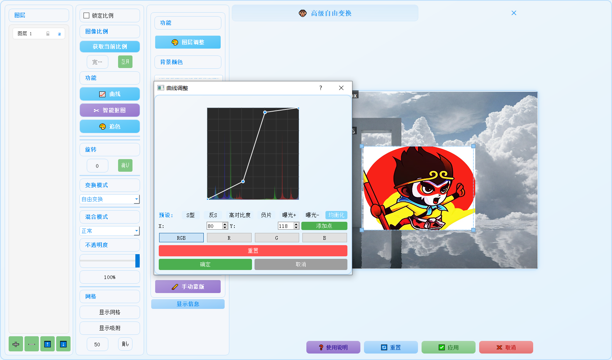

# 🐵 高级自由变换插件

一个功能强大的 ComfyUI 图像处理插件,提供专业级的图层编辑和变换功能。

## ✨ 主要特性

- 🎨 多图层管理与编辑
- 🔄 自由变换与透视变换
- ✂️ 智能抠图(支持中英文)
- 🎯 智能追色功能
- 📊 专业曲线调整
- 🎭 蒙版编辑工具
- 🌈 丰富的混合模式
- 💫 多种图层特效

## 📸 功能展示

### 智能抠图

*支持中英文提示词的智能抠图功能*

### 追色功能

*自动匹配背景图片的颜色风格*

### 曲线调整

*专业的曲线编辑功能*

### 图层效果

*丰富的图层特效*

## 🛠️ 安装方法

1. 下载插件文件
2. 将文件夹放入 ComfyUI 的 `custom_nodes` 目录
3. 重启 ComfyUI

## 🎯 使用方法

### 基础操作

1. 在节点列表中找到 "🐵 自由变换" 
2. 连接输入:
   - `background`: 背景图像
   - `foreground`: 前景图像
   - `mask`: 可选蒙版
3. 运行后会打开变换窗口

### 图层操作

- **添加图层**: 点击 "+" 按钮或拖放图片
- **删除图层**: 选中图层后点击 "-" 按钮或按 Del 键
- **图层排序**: 拖动图层列表或使用上下箭头按钮
- **图层属性**: 双击图层名称可重命名

[其他内容保持不变...]

## 📊 效果对比

### 智能抠图对比
| 原图 | 抠图结果 |
|------|----------|
|||

### 追色效果对比
| 原图 | 追色后 |
|------|---------|
|||

## 🛠️ 安装方法

1. 下载插件文件
2. 将文件夹放入 ComfyUI 的 `custom_nodes` 目录
3. 重启 ComfyUI

## 🎯 使用方法

### 基础操作

1. 在节点列表中找到 "🐵 自由变换" 
2. 连接输入:
   - `background`: 背景图像
   - `foreground`: 前景图像
   - `mask`: 可选蒙版
3. 运行后会打开变换窗口

### 图层操作

- **添加图层**: 点击 "+" 按钮或拖放图片
- **删除图层**: 选中图层后点击 "-" 按钮或按 Del 键
- **图层排序**: 拖动图层列表或使用上下箭头按钮
- **图层属性**: 双击图层名称可重命名

### 变换功能

- **自由变换**: 拖动角点进行缩放和旋转
- **透视变换**: 拖动控制点调整透视效果
- **快速操作**: 右键菜单提供翻转、旋转等功能

### 智能功能

- **智能抠图**: 支持中英文提示词
- **追色功能**: 自动匹配背景图片的颜色风格
- **曲线调整**: 专业的曲线编辑器
- **图像调整**: 亮度、对比度、饱和度等

## ⌨️ 快捷键

| 快捷键 | 功能 |
|--------|------|
| 1-9 | 快速切换图层 |
| Ctrl+C | 复制图层 |
| Ctrl+V | 粘贴图层 |
| Ctrl+L | 锁定/解锁图层 |
| Space | 显示/隐藏图层 |
| Del | 删除图层 |

## 🎨 图层效果

- 投影
- 内发光
- 外发光
- 描边

## ⚠️ 注意事项

1. 首次使用需要授权验证
2. 部分功能需要联网
3. 请勿商用,需要请联系作者
4. 建议定期保存编辑结果
5. 注意预览窗口的提示信息

## 🔍 常见问题

1. Q: 变换不生效?
   - A: 检查图层是否被锁定

2. Q: 智能抠图失败?
   - A: 尝试调整提示词或更换模型

3. Q: 追色效果不理想?
   - A: 可以在设置中调整参数

4. Q: 图层无法选中?
   - A: 检查图层是否被隐藏

5. Q: 性能问题?
   - A: 建议减少同时打开的图层数量

## 📞 联系方式

- 微信: xiutuxiaoliu
- 抖音: 悟空(AI摄影)、大师兄(AIGC)

## 📝 更新日志

### v1.0.0
- 初始版本发布
- 实现基础功能

### v1.1.0
- 添加智能抠图功能
- 优化用户界面
- 修复已知问题

## 📄 许可证

如需使用请联系作者获取授权。

## 🌟 致谢

感谢所有为这个项目提供反馈和建议的用户。

---

**作者:** 悟空  
**版本:** v3 
**更新时间:** 2025.2.7
